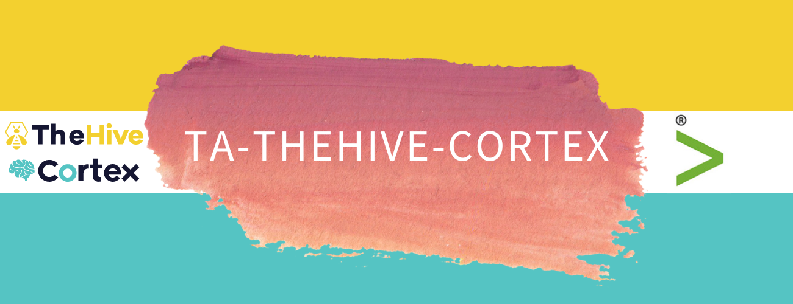

# Table of content
* [ Introduction ](#introduction)  
* [ What is Cortex ? ](#what-is-cortex-)
* [ Use Cases ](#use-cases)
* [ Installation ](#installation)
	* [ Requirements ](#requirements)
	* [ Configuration ](#configuration)
	* [ Refresh the available analyzers ](#refresh-the-available-analyzers)
* [ Usage ](#usage)
	* [ Cortex "Jobs" dashboard ](#cortex-jobs-dashboard)
		* [ History ](#history)
		* [ Run new tasks ](#run-new-tasks)
	* [ Commands in searches ](#commands-in-searches)
* [ Support ](#support)
* [ Credits ](#credits)
* [ Licence ](#licence)

# Introduction
This TA allows to **add interaction features** between [Cortex (TheHive project)](https://thehive-project.org/) and Splunk. It allows to retrieve all tasks in Cortex and to execute new tasks from Splunk, from a search or from a predefined dashboard.
All data types work with the exception of "file" because Splunk does not allow to send a file easily.

**Note**:
It's working using Python3 with the official cortex4api library included.
**A support was added to use Python2**. This is not an official library, it's a syntactically-revised version.
In other words, **it's working for Splunk 7.2 and higher versions**.

# What is Cortex ?
If you need more information about TheHive/Cortex project, please [follow this link](https://thehive-project.org/).
You can find the related [Github here](https://github.com/TheHive-Project/Cortex).

# Use Cases
The objective is to interface a SIEM tool such as Splunk in order to be able to perform automated tasks on IOCs.
This TA has been designed in such a way that :
* You can retrieve information from Cortex about the different tasks that are being performed on the scanners.
* You can run new tasks from Splunk in Cortex using the power of Splunk whether in a search or a predefined dashboard.

# Installation
## Requirements
This application contains all the python libraries to work autonomously.

**However**, a predefined dashboard of the application requires the installation of this application : [Status Indicator - Custom Visualization](https://splunkbase.splunk.com/app/3119/)

You should create a specific user and organization in your Cortex instance to interact with Splunk.

## Configuration
Once you've downloaded this application, you must configure your Cortex instance :

1. Go to the **Cortex application > Configuration** (in the navigation bar)
2. You need to specify the following settings :

* **Protocol**: Choose "http" or "https"
* **Host**: Hostname/IP of the Cortex instance
* **Port**: Port used by Cortex
* **API Key**: Corresponds to the API key used by the user/organization to be used (the user/organization will be determined automatically by Cortex)

**Note**: You can active a "debug" logging mode to have more information in searches/logs. 

## Refresh the available analyzers
Once you've configured these settings, you can refresh the list of analyzers in the application.

1. Go to the **Cortex application > Analyzers** (in the navigation bar)
2. Click on the **Refresh Analyzers** button on the top-right
3. After a while, a message indicating that "your analyzers have been reloaded" should appear with the current date. You should see the list of analyzers on the search below.

**Note**: Only enabled analyzers will be loaded

These information are stored in Splunk in order to have a mapping between available analyzers and data types.

# Usage
Once the application is configured and the analyzers are retrieved, you have several options for interfacing with Cortex.
## Cortex "Jobs" dashboard
The application integrates a preconfigured dashboard with searches allowing you to easily interface with Cortex.

### History
You can retrieve the history of jobs in Cortex using the action "LIST". By default, it's recovering the last 10 jobs.
For each job, you can see :
* **Status**: Current status for the job
* **Data**: Data and datatype for the job
* **Analyzer**: Analyzer used for the job
* **Created At**: Date and time for the creation of the job
* **Start Date**: Date and time for the start of the job (a created job could not be executed immediately)
* **Created by**: User/Organization used to created the job
* **TLP**: TLP specified for the job
* **ID**: ID of the job

**Note: You can click on the link to view the result of the job directly on Cortex** (you should be authenticated to Cortex)

You can set filters for the history:
* **Data**: filtering the "data" field, regular expressions are not working, it must be the exact match string
* **Data Types**: filtering on the "data types", several values can be specified
* **Analyzers**: filtering on the "analyzers", several values can be specified

### Run new tasks
You can start new analyses from Splunk using the "RUN" action.

You have to specify some inputs:
* **Data**: IOCs you want to analyze separated by a semicolon, they must be of the same data type
* **Data type**: corresponding to the data type of data
* **TLP**: TLP level to use for this analysis
* **PAP**  PAP level to use for this analysis
* **Analyzers**: analyzers to use, if "any" is set, it will use any enabled analyzers for the given data type

The search will execute all jobs (one IOC with one analyzer) and return information such as the job ID.

## Commands in searches
You can use new commands within your searches. For more information, please [read the associated documentation](https://github.com/LetMeR00t/TA-cortex/tree/master/docs/commands.md).
# Support
Please [open an issue on GitHub](https://github.com/LetMeR00t/TA-cortex/issues) if you'd like to report a bug or request a feature.

# Credits
This app was inspired by [this Splunk app](https://splunkbase.splunk.com/app/4380/)

# Licence
This app TA_cortex is licensed under the GNU Lesser General Public License v3.0.

