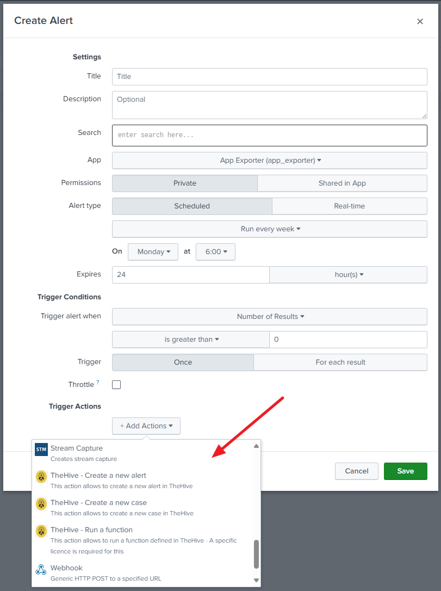
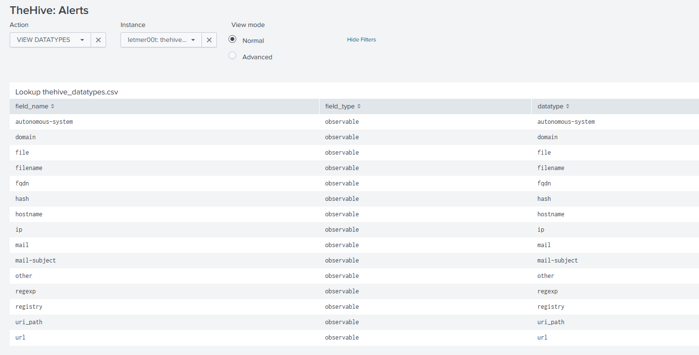
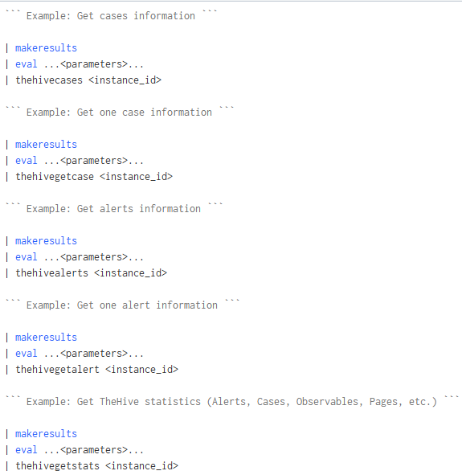
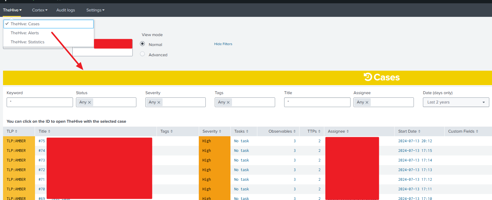

  

# Table of content

- [Table of content](#table-of-content)
- [Introduction](#introduction)
- [What is TheHive/Cortex ?](#what-is-thehivecortex-)
- [Use Cases](#use-cases)
- [Installation](#installation)
- [Usage](#usage)
	- [Custom alert actions (Splunk Enterprise) and adaptative responses (Splunk Enterprise Security)](#custom-alert-actions-splunk-enterprise-and-adaptative-responses-splunk-enterprise-security)
		- [Fields and datatypes](#fields-and-datatypes)
	- [Commands usable in Splunk searches](#commands-usable-in-splunk-searches)
	- [Dashboards](#dashboards)
- [Support](#support)
- [Credits](#credits)
- [Licence](#licence)

# Introduction

This TA allows to **add interaction features** between [TheHive or Cortex (StrangeBee)](https://www.strangebee.com/) and Splunk. It allows to retrieve all kind of information from TheHive/Cortex and to perform actions on these instances using Splunk, from a search or from a predefined dashboard.

This TA is supporting only TheHive 5. For having an app supporting TheHive 3 or 4, please check the oldest releases. It's also supporting the Cortex 3 version.

> **Note**:
It's working using Python3 with the official thehive4py and cortex4api library included. Please note that few modifications were performed to improve the features of those libraries and are shared with the original repositories owners in order to merge them in a future version
**A support was added to use Python 3.7**. As Splunk is using at most Python 3.7.11 at this time of writing, we added the support to the original library. This is not an official library, it's a syntactically-revised version.

# What is TheHive/Cortex ?

If you need more information about TheHive/Cortex project, please [follow this link](https://www.strangebee.com/).
You can find the related [TheHive Project here](https://github.com/TheHive-Project) (including Cortex).

# Use Cases

The objective is to interface a SIEM tool such as Splunk in order to be able to perform automated tasks on observables/IOCs or TTPs.
This TA has been designed in such a way that :

- You can pull events periodically from TheHive about the different cases/alerts that were created or updated
- You can create new alert or case from Splunk in TheHive using the power of Splunk whether in a search or in a predefined dashboard.
- You can run a function in TheHive from an alert action
- You can interface Splunk Enterprise Security with TheHive
- You can retrieve information from Cortex about the different jobs that are being performed on the scanners.
- You can run new tasks from Splunk in Cortex using the power of Splunk whether in a search or a predefined dashboard.

# Installation

See the [Installation guide](./docs/installation.md)

# Usage

Once the application is configured and the analyzers are loaded, you have several options for interfacing with TheHive/Cortex.

## Custom alert actions (Splunk Enterprise) and adaptative responses (Splunk Enterprise Security)

See the [Alert actions adaptative responses guide](./docs/alert_actions_and_adaptive_responses.md).

### Fields and datatypes

Alert actions use a lookup table (`thehive_datatypes.csv`) to identify supported fields as TheHive datatypes.
If this lookup table is missing, first action will attempt to create it with default list of supported data types extracted from the TheHive instance itself.

For every event that will be processed by a custom alert action, the script will try to determine which fields are observables and for that it will rely on this table accordingly. For instance, if your event has a field named "fqdn", it will consider the value of the field as a "fqdn" observable. You can update your list with your own fields accordingly by updating the lookup directly.

The file is build with those fields:

- `field_name`: Name of the field to match within your events.
- `field_type`: Always set to "observable".
- `datatype`: Indicates the datatype to use within TheHive for this field.
- `description`: Free text within your lookup. No description is provided for default datatypes.

As mentionned, you can add custom field names linked to datatypes within TheHive directly by adding them within this lookup. As long as the lookup is existing, your changes will be applied.

> For custom fields, we are directly retrieving the custom fields from the TheHive instance and it's working the same meaning that if you have a custom field named "my_custom_field", then you just need to have a field named "my_custom_field" with the value you want to set for this custom field.

## Commands usable in Splunk searches

See the [Commands guide](./docs/commands.md).

## Dashboards

See the [Dashboards guide](./docs/dashboards.md)

# Support

Please [open an issue on GitHub](https://github.com/LetMeR00t/TA-cortex/issues) if you'd like to report a bug or request a feature.

# Credits

This app was inspired by [this Splunk app](https://splunkbase.splunk.com/app/4380/)

# Licence

This app TA_cortex is licensed under the GNU Lesser General Public License v3.0.
