# Introduction

This TA provides an adaptative response/alert action. It takes the result of a search and creates an alert on [TheHive](https://thehive-project.org)
The overall process is as follows:

- search for events & collect observables and custom fields.
- rename splunk fields to match the field names listed in the lookup table thehive_datatypes.csv. If you haven't created it before the first alert,
it will be initialised with the default datatypes (see [example file](../TA-thehive-cortex/README/thehive_datatypes.csv.sample))
- save your search as an alert.
- set the alert action "thehive_create_a_new_alert": it will create an alert into TheHive.
- you can pass additional info, TLP per observables, custom fields, modify title, description, etc. directly from the results of your search.

> Please note that the following examples are only there to formalize example of data and explain how the script is processing them

In this example, we have configured several custom fields on TheHive:


# Use cases examples

In order to help you understand how you can customize the alerts you are configuring and the information you can provide, several use cases (examples) are shown here and will be used to explain/detail what you need to know:

## UC1: Saved search - One single alert

### Prerequisites

- Splunk instance (Splunk Enterprise licence required)
- TheHive instance (no licence required)

### Splunk search

Input:

```text
| makeresults
| eval ip="1.2.3.4", fqdn="fake-website.com"
| table ip, fqdn
| append
    [| makeresults
| eval hash="a27fa23e7316cb8fb7a57bd11664f2ff"
| table hash]
| eval name = "T1027.003 - Obfuscated Files or Information: Steganography", cert-alerted-on=now(), risk="Medium", ttp="defense-evasion::T1027.003::"+tostring(strftime(now(),"%Y-%m-%d"))
| eval unique = now()
```

Output:


### Splunk screenshots

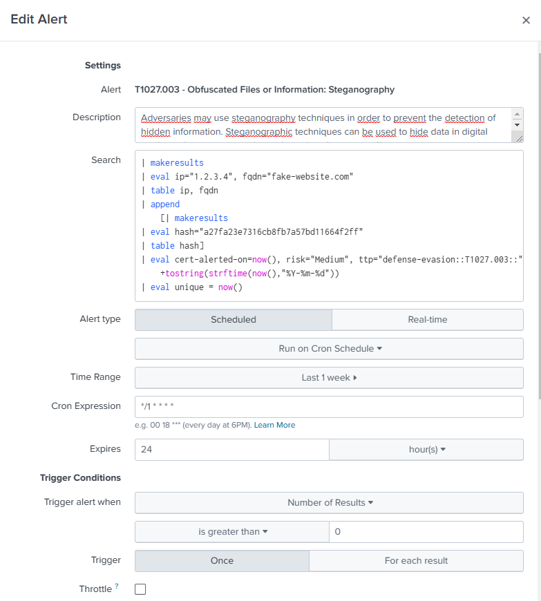


### TheHive screenshots

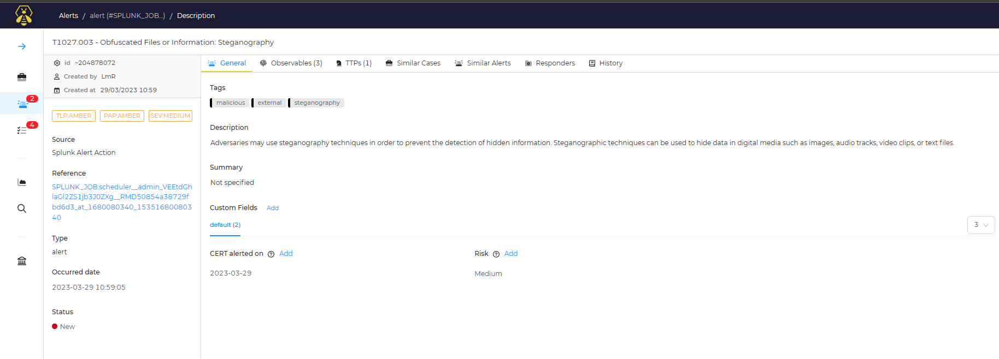


## UC2: Saved search - Several alerts

### Prerequisites

- Splunk instance (Splunk Enterprise licence required)
- TheHive instance (no licence required)

### Splunk search

Input:

```text
| makeresults
| eval ip="5.6.7.8", ttp="reconnaissance::T1595.001::"+tostring(strftime(now(),"%Y-%m-%d")), unique=tostring(now())+".1"
| table ip, ttp, unique
| append
    [| makeresults
| eval ip="1.2.3.4", ttp="reconnaissance::T1593.002::"+tostring(strftime(now(),"%Y-%m-%d")), unique=tostring(now())+".1"
| table ip, ttp, unique]
| append
    [| makeresults
| eval ip="1.3.5.8", ttp="reconnaissance::T1593.002::"+tostring(strftime(now(),"%Y-%m-%d")), unique=tostring(now())+".2"
| table ip, ttp, unique]
| eventstats values(ip) as all_ip by unique
| eval all_ip = mvjoin(all_ip,", ")
| eval name = "Massive scan on website company.corp from "+all_ip, cert-alerted-on=now(), risk="Medium"
```

> Please note that the field "all_ip" is used to build the title but will not be taking into account by the script as it's not a relevant field (not a custom field nor an observable or a reserved named field for TheHive)

Output:


### Splunk screenshots

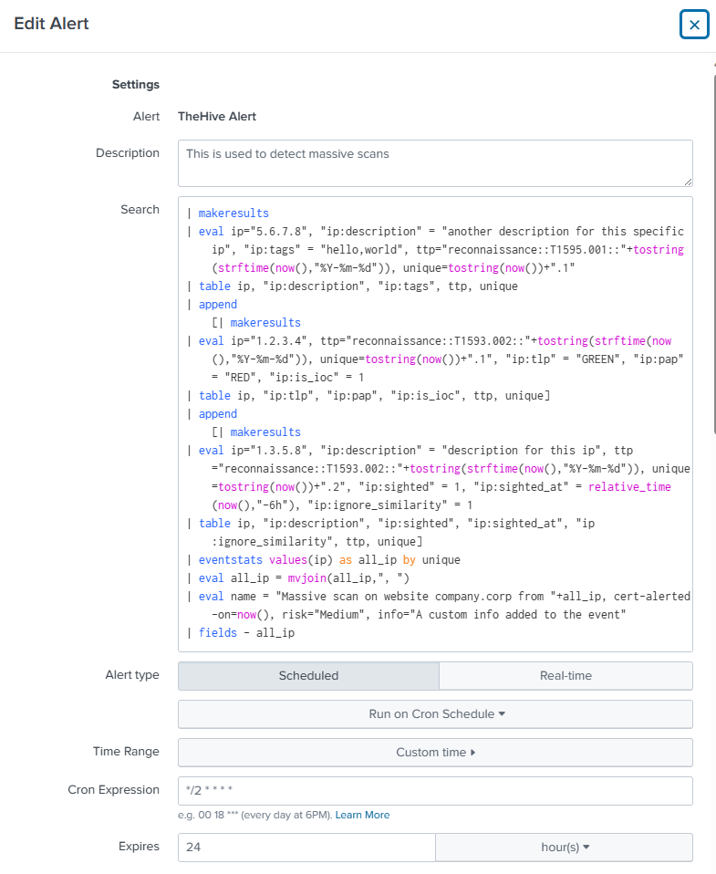
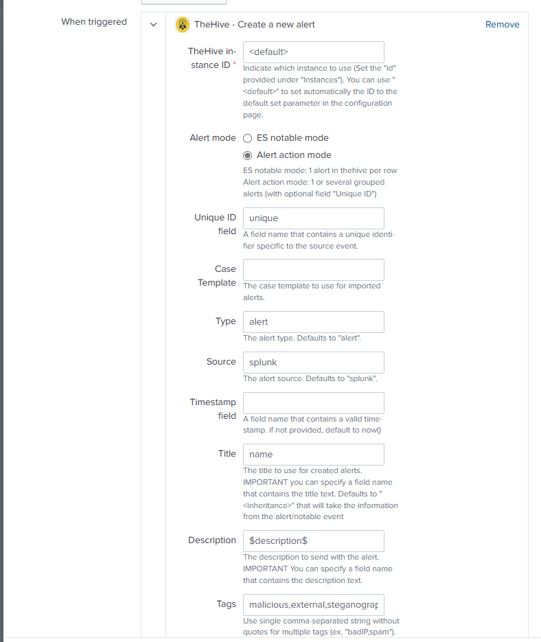

### TheHive screenshots


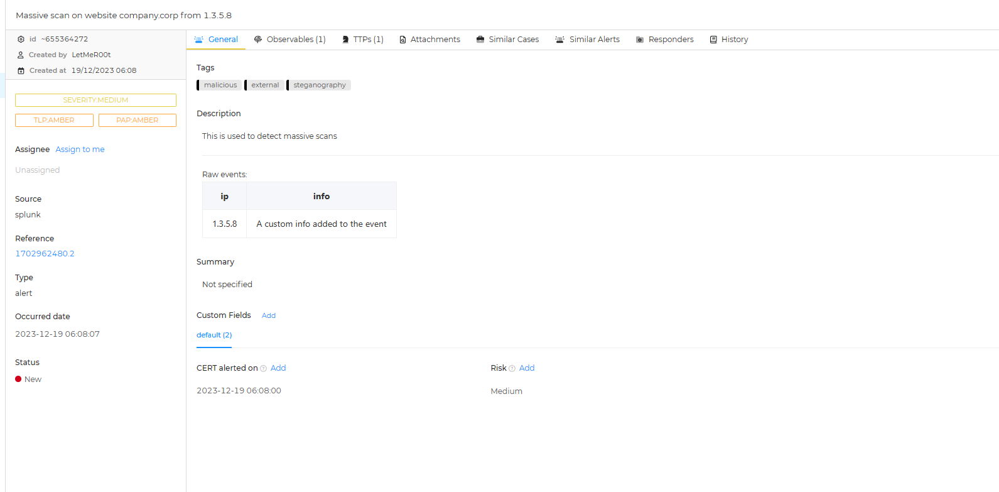


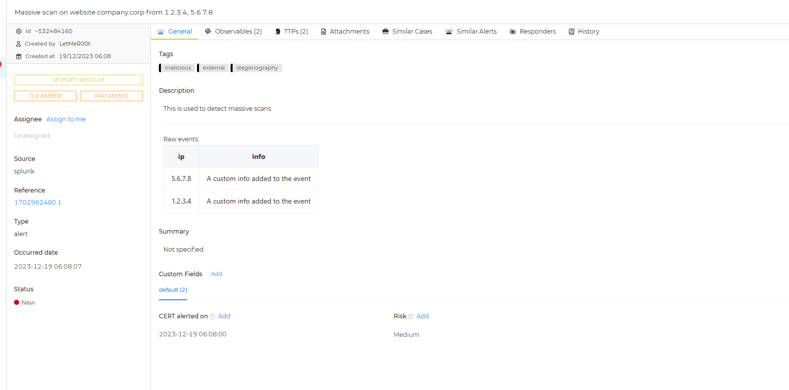


## UC3: Correlation Search - One single case

### Prerequisites

- Splunk instance (Splunk Enterprise Security licence required)
- TheHive instance (no licence required)

### Splunk search

Input:

```text
| makeresults
| eval other="account-12345", hostname="mycloud.aws.instance.corp"
| eval cert-alerted-on=now(), risk="Medium"
```

Output:


### Splunk screenshots


### TheHive screenshots

> Please note that no TTP was created. As the correlation search is run as a savedsearch, it's the same behavior and we can't have access to the correlation search information, such as the TTPs. To migitate this, you can add manually your TTPs in the search itself, see the previous use cases for examples.


## UC4: Notable event - Adaptative Response

### Prerequisites

- Splunk instance (Splunk Enterprise Security licence required)
- TheHive instance (no licence required)

### Splunk search

Input:

```text
| makeresults
| eval other="account-12345", hostname="mycloud.aws.instance.corp"
| eval cert-alerted-on=now(), risk="Medium"
```

Output:


### Splunk screenshots


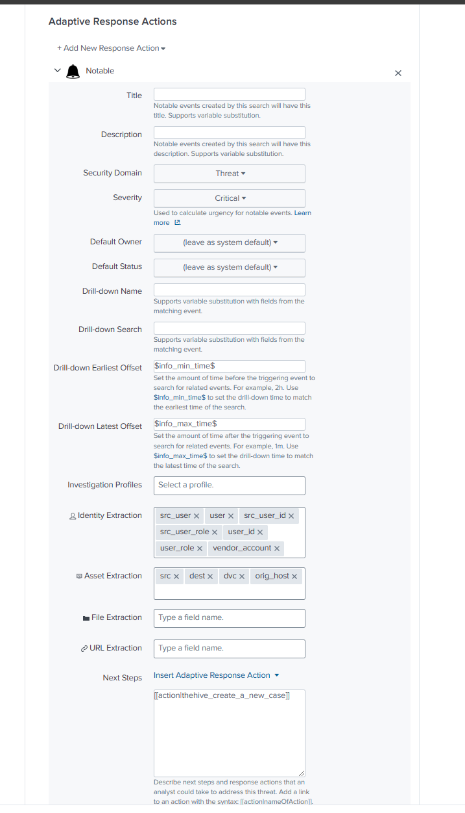

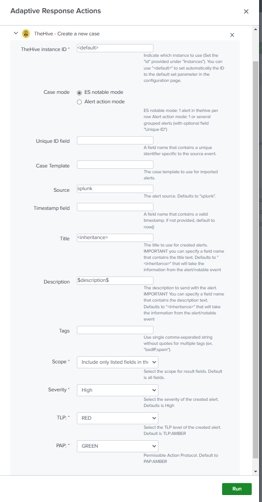


### TheHive screenshots


## UC5: TheHive Function - Saved search, Correlation search or Adaptative Response

### Prerequisites

- Splunk instance (Splunk Enterprise licence required at minimum, but works for Splunk Enterprise Security features)
- TheHive instance (specific licence is required)

### TheHive Function screenshots

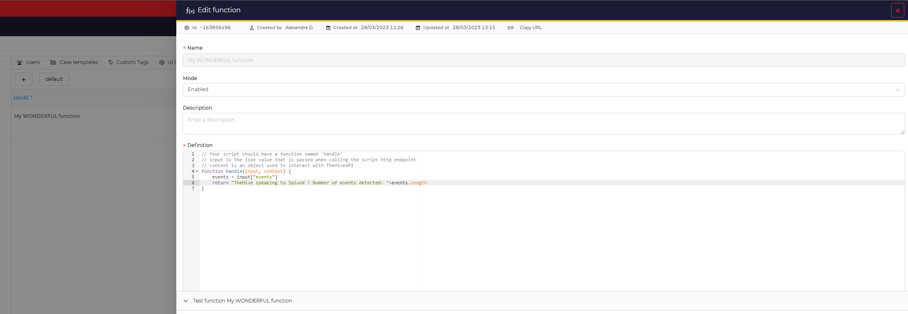


### Splunk screenshots

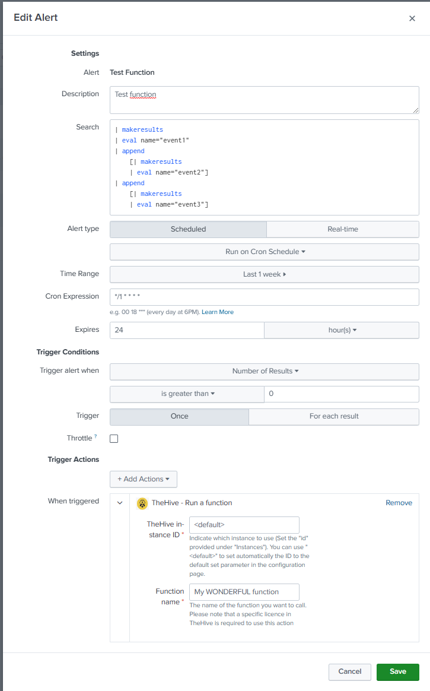
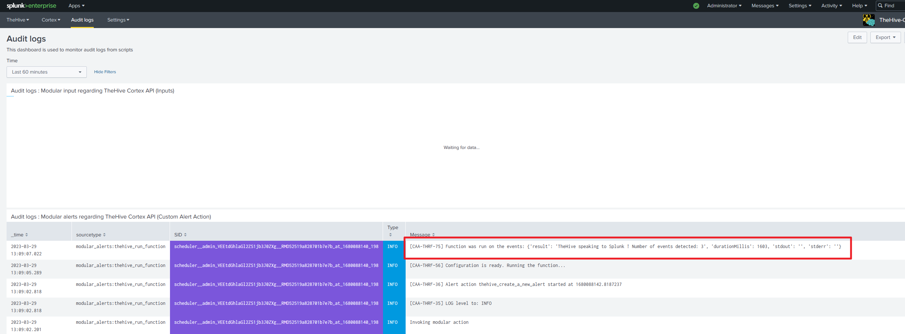

# Use cases detailed

> UC5 is not detailed as it's just pushing events to a custom Function in TheHive

| Field | Description | UC1 | UC2 | UC3 | UC4
|---|---|---|---|---|---|
| Title | This is used to create the title of an alert/case in TheHive  | Use the parameter "&lt;inheritance&gt;" that will take the name of the savedsearch as the title | Use the field named "name" from the results as the title | Use the parameter "&lt;inheritance&gt;" that will take the name of the correlation search as the title | Same as UC3 (if nothing was provided, the name of the search_name from Splunk ES would be taken by default) |
| Description | This is used to create the description of an alert/case in TheHive| Static string sentence set in the Description alert parameter | Use the savedsearch description itself as the description of the alert/case | Same as UC2 | [Intentional bug] The default "No description provided" is used as the token `$description$` is returning nothing because it's a notable event and not a savedsearch or correlation search |
| TLP | This is used to set the TLP of an alert/case | Set to "AMBER" in the savedsearch configuration | Same as UC1 | Set to "AMBER" in the correlation search configuration | Set to "RED" in the adaptative response configuration |
| PAP | This is used to set the PAP of an alert/case | Set to "AMBER" in the savedsearch configuration | Same as UC1 | Set to "AMBER" in the correlation search configuration | Set to "GREEN" in the adaptative response configuration |
| Severity | This is used to set the severity of an alert/case | Set to "Medium" in the savedsearch configuration | Same as UC1 | Set to "High" in the correlation search configuration | Automatically set based on the notable event severity, here "CRITICAL" |
| Owner | This is used to indicate who is the owner of the case | No owner in alerts | Same as UC1 | Owner is set automatically to the account that created the case (used to communicate with TheHive) | Same as UC3 |
| Source | This indicates the source of the alert | Manually set in the savedsearch configuration | Same as UC1| No source in cases | Same as UC3 |
| Type | This indicates the type of the alert | Manually set in the savedsearch configuration | Same as UC1 | No type in cases | Same as UC3 |
| Tags | This is used to indicate the tags of an alert/case | Tags are defined in the savedsearch configuration with three tags separated by a comma (malicious,external,steganography) | Same as UC1 (even if the tags aren't accurate, it was more for an example) | Tag is defined in the correlation search configuration (cloud) | No tag was provided in the Adaptive Response |
| Custom fields | This is used to define custom fields in TheHive for alerts/cases. **Note**: Custom fields information are retrieved from an API call at each execution | Two custom fields are given the results directly using the field name as the name of the custom field and the field value as the custom field value (in this example, `cert-alerted-on` and `risk`) | Same as UC1 (we could have different custom fields by alert) | Same as UC1 | Same as UC1 |
| Tasks | This indicates the tasks of a case | No task in alerts | Same as UC1 | Tasks can't be created from events, you shoudl rely on the "`CaseTemplate`" savedsearch/correlation search parameter instead to define which case template (that will contains the tasks) you want to use | Same as UC3 |
| Observables | This is used to define observables in alerts/cases | There are built from the results with name of the field as the type of the observable and the field value as the value of the observable (here 3 observables: ip, fqdn and hash). There is only one alert from these two events as it's the same `unique` value which is used by the savedsearch configuration to separate alerts | Same as UC1 except that we have two dedicated alerts (one with one IP, one with two IPs) because the `unique` field is different | Same as UC1 except that we have two observables (one other, one hostname) | Same as UC3 |
| TTPs | This is used to indicate which TTPs are linked to alerts/cases | This is built from the events with the field named "ttp" which is having a string with 3 information (tactic, pattern ID and the occur date, all three mandatory) separated by two colons, here two TTPs for the same alert | Same as UC1 except we have 2 TTPs in one alert and 1 TTP in another alert | No TTP is provided from the events and as the correlation search is sending the events directly to the script as a savedsearch does, we don't have any information about the configured TTPs | TTPs are recovered from the notable event created that is having the list of TTPs linked to the correlation search. Those TTPs are automatically created from those information |


## Tips & Tricks

### How to fill in form fields

Fill in form fields. If value is not provided, default will be provided if needed.  
Provide field names as they are in the results of the search: for example, you can use a field of your search results named "mytitle" to define alert title from results of the search. The search must return a field 'mytitle' of type string. You can mix static string and usage of field values of your search results. You can also specify a title/description by using fields results with `$result.YOUR FIELD$`
For example, these strings are accepted:

- This is my static title

In this example, alert title will be "This is my static title".

- This is a dynamic title with `$result.myfield$`

In this example, alert title will be "This is a dynamic title with abc" if "abc" was the value of the field myfield in **first row** of the result set. The substitution is done by sendalert at the time of launching the action

- `myfield`

In this example, alert title will be the value of field `myfield` from result set. The difference here is that the substitution is handle by app script and can be different if several alerts are created in Thehive from the same result set (using form field "unique ID field" - see below)

### Alert overall description

- TheHive instance: one of the instances defined in the instances dashboard. You can use "&lt;default&gt;" to use the default instance defined in the configuration page
- Case Template: A case template to use for imported alerts.
- Type: The alert type. Defaults to "alert".
- Source: The alert source. Defaults to "splunk".
- Unique ID field: A field name that contains a unique identifier specific to the source event. You may use the field value to group artifacts from several rows under the same alert. The value for the field "unique" have to be the same on those rows.
- Timestamp: A field name that contains a valid timestamp (epoch10 or epoch13 formats are supported). if not provided, default to now() 
- Title: The title to use for created alerts. You can specify a field name to take the title from the row specified like a token usage in a dashboard (see below)
- Description: The description to send with the alert. You can specify a field name to take the description from the row (see below)
- Tags: Use single comma-separated string without quotes for multiple tags (ex. "badIP,spam").
- Scope: you can choose to (option 1) include **only listed** fields in thehive_datatypes.csv or (option 2) include **all fields** (default datatype is 'other')
- Severity: Change the severity (Low/Medium/High) of the created alert. Default is High
- TLP: Change the TLP of the created alert. Default is TLP:AMBER
- PAP: Change the PAP of the created alert. Default is PAP:AMBER

### Manage fields to become observable, enrich the alert with inline fields

#### Here some precisions

- Values may be empty for some fields; they will be dropped gracefully.
- Only one combination (dataType, data, tags) is kept for the same alert (or having same "Unique ID").
- You may add any other columns, they will be passed as simple elements (other) if you select option "include **all fields** (default datatype is 'other')"
- You can add other observables by listing them in the lookup table first and having corresponding field name(s) in your search.
- You can add custom fields (internal reference) by listing them in the lookup table first and having corresponding field name(s) in your search.

#### Use fields to provide values for the alert

In the alert form, you can specify a field name instead of a static string for following parameters:

- Unique ID field: if you provide a field name, the result rows will be grouped under each unique value of this field. For example, if 5 rows have the value "alert1" in field **my_unique** and 3 rows have "alert2", then by mentioning in the form for parameter "unique" the field name "my_unique", the script will create 2 alerts in TH, one with observables from the first 5 rows (deduplicated) and a second with observables from the 3 other rows.
- timestamp: you can provide a field containing a valid timestamp value (epoch10 or epoch13) for example _time
- description: the description of the alert can be taken from the value of a field. Provide field name as it is in results
- title: title of the alert can be taken from the value of a field. Provide field name as it is in results. It can be a mix so you can use a static string with a field result. If you have a field named "title" then you can specify : "My title is $result.title$"

**IMPORTANT** fields used to set timestamp, description or title are not removed from results set and pushed to TheHive as artifact or custom fields.

#### Custom TLP per observable

If you want to set a different TLP level than the one set for the alert, append to the field name
    - :R for TLP:RED
    - :A for TLP:AMBER
    - :G for TLP:GREEN
    - :W for TLP:WHITE

```text
For example if you rename src field as "src:R", then this observable will be set with TLP:RED whatever is the TLP level for the alert.
```

#### Inline tag(s)

1 additional field can be used inline:

- th_inline_tags: if field **th_inline_tags** exists, then the list of tags (comma-separated string) is added to the observables taken from that row.  
- A final tips to add specific tags to a field is to rename the field to append a text after a ":". For example, to add tag "C2 server" to an ip used this syntax (this option is not possible if you use custom TLP level).

```text
| rename ip as "ip:C2 server"
```

In conclusion, the tags attached to each observable are field name, specific tags (using :), inline_tags and tags from the alert form

### Advanced search results with additional tags

1. add to your search a field th_inline_msg. Tags defined in that field will be attached to each artifact
2. rename the field to include a tag section using the syntax "a dataType:some tag". the field name will be split on first ":" and the second part added to the list of tags

You can try the following dummy search to illustrate this behaviour.

```text
index=_* 
| streamstats count as rc 
| where rc < 4
| eval "ip:APTxx"="1.1.1."+rc 
| eval domain="www.malicious.com" 
| eval th_inline_tags="C2,Campaign1234,PAP:AMBER"
| eval src=10.11.12.13 
| rename src as "src:R"
| eval playbook = "playbook title"
| eval hash:md5="f3eef6f636a08768cc4a55f81c29f347"
| table "ip:APTxx" hash:md5 domain "src:R" playbook th_inline_tags
```
